# Crafted Coffee ☕

<b>Description:</b>

Crafted Coffee is a modern and responsive coffee-themed website developed using HTML, CSS, and JavaScript. The project showcases a visually appealing user interface designed to provide users with an engaging browsing experience. It includes well-structured sections such as a homepage, menu display, product highlights, and contact information, all styled with clean and aesthetic design principles.

The website focuses on delivering smooth navigation and interactive elements using JavaScript, enhancing user engagement through dynamic content and responsive layouts. Special attention has been given to UI/UX design, ensuring compatibility across different devices and screen sizes.

This project demonstrates front-end development skills, including layout structuring, styling with CSS, and adding interactivity using JavaScript. The site is deployed using Netlify, allowing fast and reliable access through a live URL.

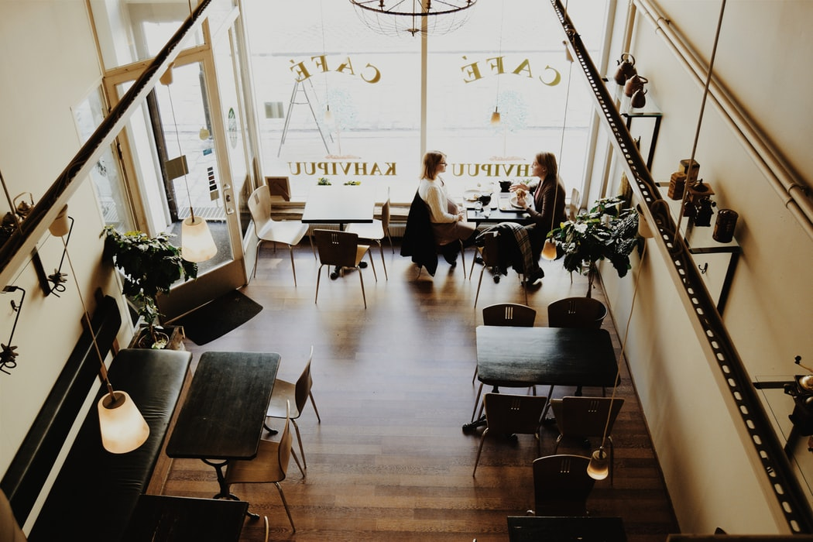

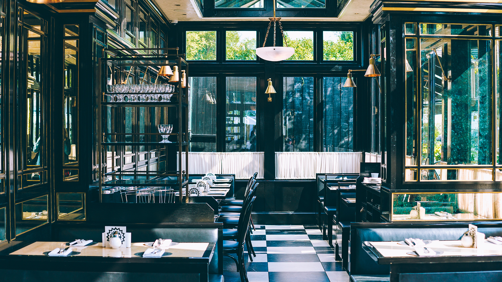

index page :
```html
<!DOCTYPE html>
<html lang="en">

<head>
  <script src="https://kit.fontawesome.com/cd9d9c0a37.js" crossorigin="anonymous"></script>
  <link rel="stylesheet" href="coffee.css">
</head>

<body>

  <section class="main">
    <div>
      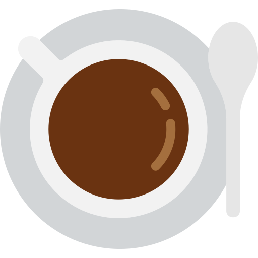
    </div>

    <div style="margin-right:100px;">
      <ul>
        <li><a href="#"><b>CONTACT US</b></a></li>
        <li><a href="#"><b>DISCOVER</b></a></li>
        <li><a href="#"><b>ABOUT US</b></a></li>
        <li><a href="#"><b>HOME</b></a></li>
      </ul>
    </div>
  </section>
  <section>
    <div class="first">
      <div class="second">
        <h1
          style="color: aliceblue;font-family:SpartanLimport;text-align: center;margin-top:300px;font-size: 56px;letter-spacing:3px;">
          Crafted Coffees</h>
          <p
            style="color:aliceblue;font-family:Poppins, sans-serif;text-align: center;margin-top:20px;font-size:30px;letter-spacing:4px;">
            "Coffee पे चर्चा"</p>

      </div>
      <div class="arrow-container">
        
      </div>
    </div>
  </section>


  <section class="abc">
    <div class="div">
      <br><br>
      <h3 class="h3">MADE IN US</h3><br><br>
      <p class="para">Lorem, ipsum dolor sit amet<br> consectetur adipisicing elit.</p>
      <p style="text-align: center;"> Obcaecati, porro.</p>
    </div>
    <div class="div">
      <br><br>
      <h3 class="h3">RELAXATION</h3><br><br>
      <p class="para">Lorem, ipsum dolor sit amet<br> consectetur adipisicing elit.</p>
      <p style="text-align: center;"> Obcaecati, porro.</p>
    </div>
    <div class="div">
      <br><br>
      <h3 class="h3">ENERGY</h3><br><br>
      <p class="para">Lorem, ipsum dolor sit amet <br>consectetur adipisicing elit.</p>
      <p style="text-align: center;" > Obcaecati, porro.</p>
    </div>
    <div class="div">
      <br><br>
      <h3 class="h3">FAMILY RECIPE</h3><br><br>
      <p class="para-a">Lorem, ipsum dolor sit amet<br> consectetur adipisicing elit.</p>
      <p style="text-align: center;"> Obcaecati, porro.</p>
    </div>
  </section>

  <section style="display: flex;margin-top: 50px;">
    <div class="vedio-container">
      <video autoplay muted loop class="vedio">
        <source src="images/woman-drinking-coffee.mp4" type="video/mp4">
      </video>
    </div>
    <div style="margin-top:50px;margin-left:30px;">
      <h3 style="color: brown;">ABOUT</h3>
      <h2>Crafted Coffee's</h2><br>
      <p>Lorem ipsum dolor sit amet consectetur adipisicing elit.<br> Corrupti, dolores.</p><br>
      <p>Lorem ipsum dolor sit amet consectetur adipisicing elit.<br> Corrupti, dolores.</p><br><br>
      <a href="#" class="button"><b>LEARN MORE</b></a>
    </div>
  </section>

  <section>
    <div class="back">
      <div class="back1">
        <h1 style="color: red;text-align: center;margin-top:70px;font-size: 30px;"> Discover</h1>
        <p class="xyz">OUR MENU</p>
      </div>
    </div>
  </section> <br><br>

  <section class="nav">

    <div class="nav-div">
      <hr class="hr">
    </div>

    <button type="button" id="snacks" class="butt"  onclick="toggleMenu()">
      
    </button>

    <button type="button" id="snacks" class="butt" onclick="toggleMenu()">
      
    </button>

    <div class="nav-div">
      <hr class="hr">
    </div>

  </section>

  
  <div class="menu-drinks-onn">

    <!-- First Card  -->
    <section style="display:inline;background-color: white;" id="first">
      <article class="menu-section">
        <div class="flip-card">
          <div class="flip-card-inner">
            <div class="flip-card-front">
              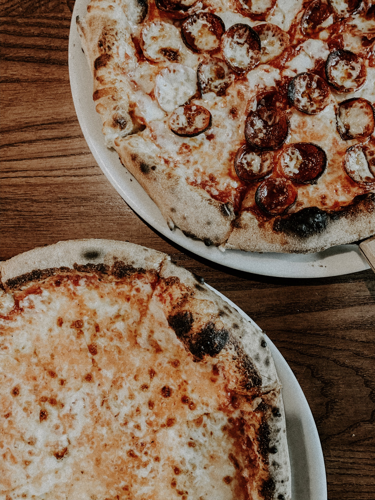
            </div>
            <div class="flip-card-back">
              <div class="menu-text">
                <h3 class="menu-text-title">PIZZA</h3>
                <p class="about-text">" Lorem ipsum dolor sit amet consectetur adipisicing elit. Corrupti, dolores. "
                </p>
                <h3 class="menu-text-title">₹ COST</h3>
              </div>
            </div>
          </div>
        </div>
      </article>


      <!-- Second Card -->

      <article class="menu-section">
        <div class="flip-card">
          <div class="flip-card-inner">
            <div class="flip-card-front">
              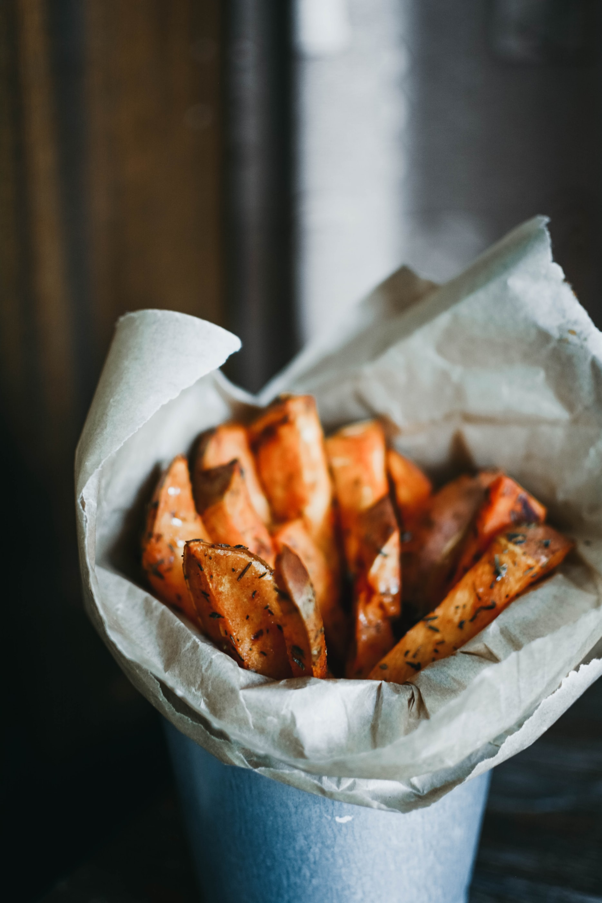
            </div>
            <div class="flip-card-back">
              <div class="menu-text">
                <h3 class="menu-text-title">FRIES</h3>
                <p class="about-text">" Lorem ipsum dolor sit amet consectetur adipisicing elit. Corrupti, dolores. "
                </p>
                <h3 class="menu-text-title">₹ COST</h3>
              </div>
            </div>
          </div>
        </div>
      </article>


      <!-- Third Card -->

      <article class="menu-section">
        <div class="flip-card">
          <div class="flip-card-inner">
            <div class="flip-card-front">
              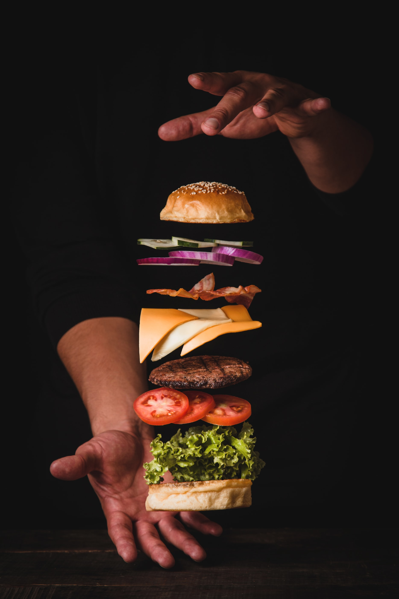
            </div>
            <div class="flip-card-back">
              <div class="menu-text">
                <h3 class="menu-text-title">BURGER</h3>
                <p class="about-text">" Lorem ipsum dolor sit amet consectetur adipisicing elit. Corrupti, dolores. "
                </p>
                <h3 class="menu-text-title">₹ COST</h3>
              </div>
            </div>
          </div>
        </div>
      </article>


      <!-- Fourth Card -->

      <article class="menu-section">
        <div class="flip-card">
          <div class="flip-card-inner">
            <div class="flip-card-front">
              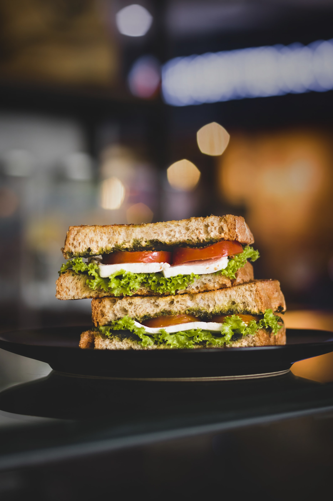
            </div>
            <div class="flip-card-back">
              <div class="menu-text">
                <h3 class="menu-text-title">SANDWICH</h3>
                <p class="about-text">" Lorem ipsum dolor sit amet consectetur adipisicing elit. Corrupti, dolores. "
                </p>
                <h3 class="menu-text-title">₹ COST</h3>
              </div>
            </div>
          </div>
        </div>
      </article>
    </section>

  </div>

  <div class="menu-drinks-onn">
    <!-- Fifth Card  -->
    <section style="display:inline;background-color: white;">
      <article class="menu-section">
        <div class="flip-card">
          <div class="flip-card-inner">
            <div class="flip-card-front">
              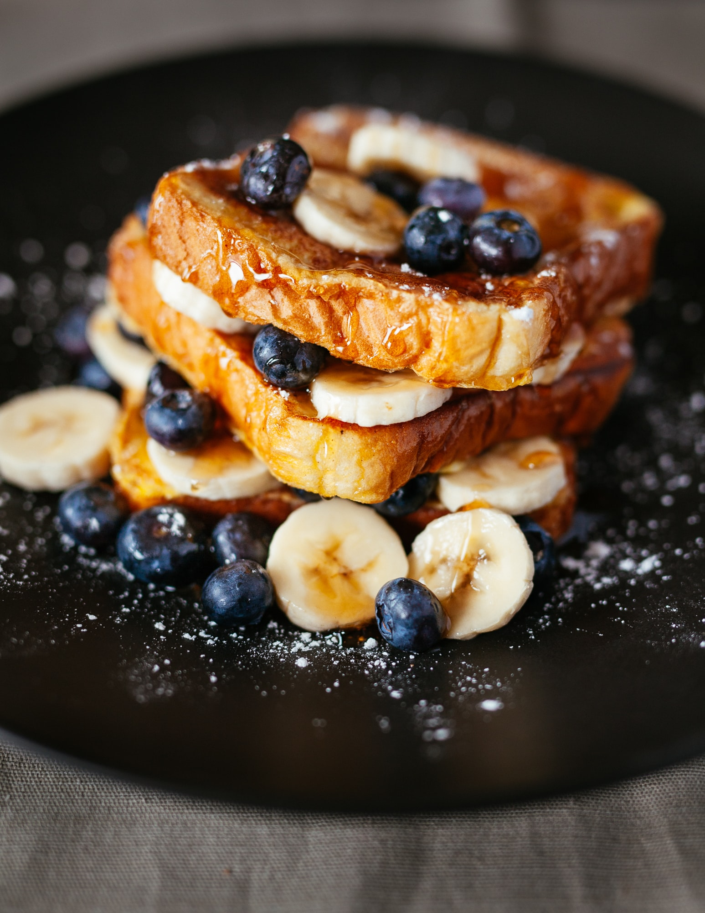
            </div>
            <div class="flip-card-back">
              <div class="menu-text">
                <h3 class="menu-text-title">WTH IS THIS??</h3>
                <p class="about-text">" Lorem ipsum dolor sit amet consectetur adipisicing elit. Corrupti, dolores. "
                </p>
                <h3 class="menu-text-title">₹ COST</h3>
              </div>
            </div>
          </div>
        </div>
      </article>

      <!-- Sixth Card -->

      <article class="menu-section">
        <div class="flip-card">
          <div class="flip-card-inner">
            <div class="flip-card-front">
              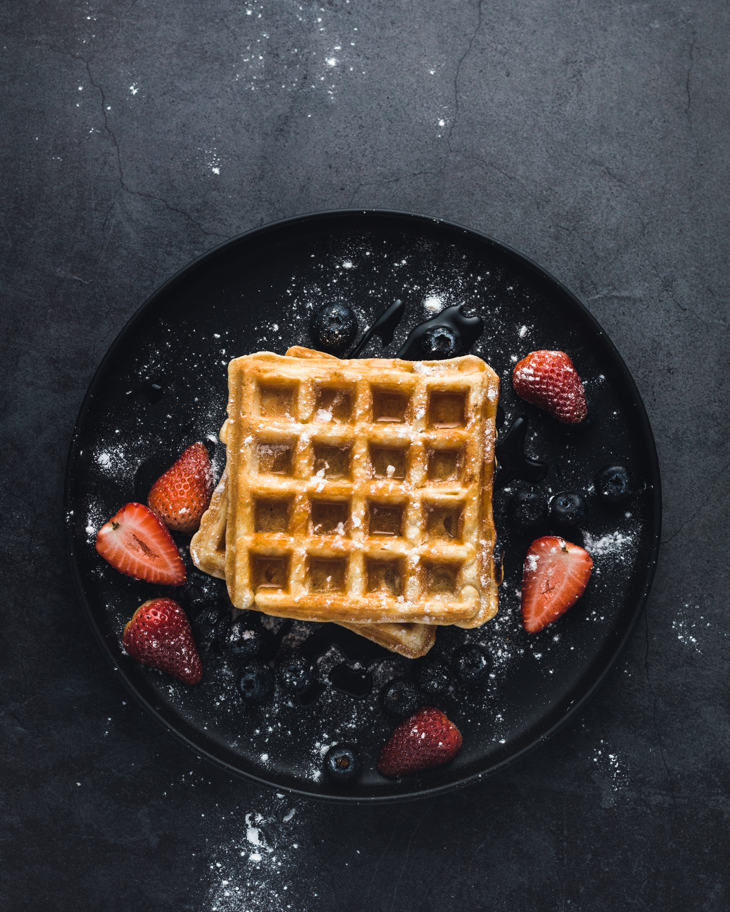
            </div>
            <div class="flip-card-back">
              <div class="menu-text">
                <h3 class="menu-text-title">WAFFLE</h3>
                <p class="about-text">" Lorem ipsum dolor sit amet consectetur adipisicing elit. Corrupti, dolores. "
                </p>
                <h3 class="menu-text-title">₹ COST</h3>
              </div>
            </div>
          </div>
        </div>
      </article>

      <!-- Seventh Card -->

      <article class="menu-section">
        <div class="flip-card">
          <div class="flip-card-inner">
            <div class="flip-card-front">
              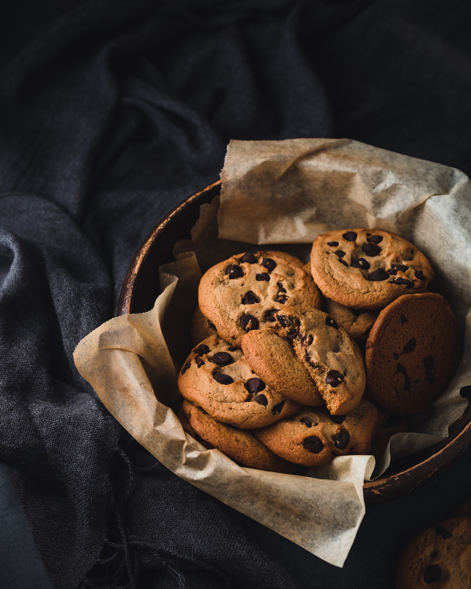
            </div>
            <div class="flip-card-back">
              <div class="menu-text">
                <h3 class="menu-text-title">COKKIES</h3>
                <p class="about-text">" Lorem ipsum dolor sit amet consectetur adipisicing elit. Corrupti, dolores. "
                </p>
                <h3 class="menu-text-title">₹ COST</h3>
              </div>
            </div>
          </div>
        </div>
      </article>


      <!-- Eighth Card -->

      <article class="menu-section">
        <div class="flip-card">
          <div class="flip-card-inner">
            <div class="flip-card-front">
              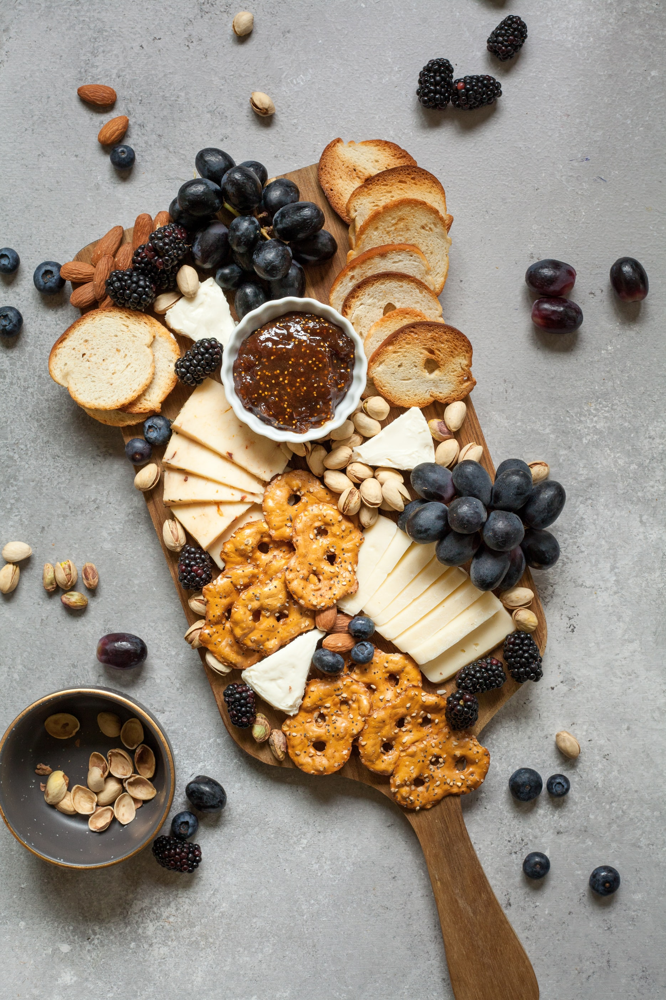
            </div>
            <div class="flip-card-back">
              <div class="menu-text">
                <h3 class="menu-text-title">MIXED BREAKFAST</h3>
                <p class="about-text">" Lorem ipsum dolor sit amet consectetur adipisicing elit. Corrupti, dolores. "
                </p>
                <h3 class="menu-text-title">₹ COST</h3>
              </div>
            </div>
          </div>
        </div>
      </article>
    </section>
  </div>
  <br>
  <br>


  <section style="margin-left:50px;margin-top:500px;display:flex;">
    <div style="width: 50%;">
      <h2 style="margin-bottom:30px;color: brown;">YOUR RESPONSE</h2>

      <form>
        <label for="fname">NAME:</label><br>
        <input type="text" id="fname" name="fname" value="" placeholder="Bryer Churco"><br><br>
        <label for="lname">CITY:</label><br>
        <input type="text" id="lname" name="lname" value="" placeholder="City Name:"><br><br>
        <label for="fname">EMAIL:</label><br>
        <input type="text" id="fname" name="fname" value="" placeholder="bryer3456@gmail.com"><br><br>
        <label for="lname">YOUR OPINION:</label><br>
        <fieldset class="fieldset rating">
          <input type="radio" id="star5" name="rating" value="5">
          <label class="half" for="star4half" title="Pretty Good">
          </label>
          <input type="radio" id="star5" name="rating" value="5">
          <label class="half" for="star4half" title="Pretty Good">
          </label>
          <input type="radio" id="star5" name="rating" value="5">
          <label class="half" for="star4half" title="Pretty Good">
          </label>
          <input type="radio" id="star5" name="rating" value="5">
          <label class="half" for="star4half" title="Pretty Good">
          </label>
          <input type="radio" id="star5" name="rating" value="5" onclick="URL('black star.jpg')">
        </fieldset><br>
        <label for="subject">YOUR REVIEW:</label><br><br>
        <textarea id="feedback" name="feedback" placeholder="Your Thoughts" style="height:120px;width: 80%;border-radius:5px;background-color: #E0E5EC;"></textarea><br><br>
        <input type="submit" >
      </form>
    </div>


    <div style="width:50%;">
      <h1 style="font-size:25px;color: brown;letter-spacing: 3px;">TESTIMONIALS</h1>
      <div class="slideshow">
        <div class="fade">
          <p>
            “ Far far away, behind the word mountains, far from the countries Vokalia and Consonantia,
            there live the blind texts. Separated they live
            in Bookmarksgrove right at the coast of the
            Semantics, a large language ocean. ”
          </p>
          <br>
          
          <h3 class="slider-name">Charles White</h3><br><br>
          <hr class="slides-hr">
          <div style="margin-left:230px;margin-top:5px;">
            
            
          </div>

        </div>
      </div>

      <div class="slideshow">
        <div class="fade">
          <p>
            “ Far far away, behind the word mountains, far from the countries Vokalia and Consonantia,
            there live the blind texts. Separated they live
            in Bookmarksgrove right at the coast of the
            Semantics, a large language ocean. ”
          </p>
          <br>
          
          <h3 class="slider-name">Seth Doyle</h3><br><br>
          <hr class="slides-hr">
          <div style="margin-left:230px;margin-top:5px;">
            
            
          </div>

        </div>
      </div>

      <div class="slideshow">
        <div class="fade1">
          <p>
            “ Far far away, behind the word mountains, far from the countries Vokalia and Consonantia,
            there live the blind texts. Separated they live
            in Bookmarksgrove right at the coast of the
            Semantics, a large language ocean. ”
          </p>
          <br>
          
          <h3 class="slider-name">Mellisa Howard</h3><br><br>
          <hr class="slides-hr">
          <div style="margin-left:230px;margin-top:5px;">
            
            
          </div>

        </div>
      </div>

      <div class="slideshow">
        <div class="fade1">
          <p>
            “ Far far away, behind the word mountains, far from the countries Vokalia and Consonantia,
            there live the blind texts. Separated they live
            in Bookmarksgrove right at the coast of the
            Semantics, a large language ocean. ”
          </p>
          <br>
          
          <h3 class="slider-name">DeMorris Byrd</h3><br><br>
          <hr class="slides-hr">
          <div style="margin-left:230px;margin-top:5px;">
            
            
          </div>

        </div>
      </div>
      <div style="text-align: center;">
        <span class="dot"></span>
        <span class="dot"></span>
        <span class="dot"></span>
      </div>
    </div>
  </section><br><br><br>
<section>
  <div class="locate">
    <div class="locateus">
<p style="color: red;text-align: center;margin-top:80px;font-size:30px ;"><b>CONTACT</b></p>
<p  style="color: aliceblue;letter-spacing: 2px;text-align:center;font-size:40px;margin-top:50px;"><b>LOCATE US</b></p>
    </div>
  </div>
</section><br><br>
<section style="display: flex;">
  <div>
 <iframe src="https://www.google.com/maps/embed?pb=!1m18!1m12!1m3!1d2990.274257380938!2d-70.56068388481569!3d41.45496659976631!2m3!1f0!2f0!3f0!3m2!1i1024!2i768!4f13.1!3m3!1m2!1s0x89e52963ac45bbcb%3A0xf05e8d125e82af10!2sDos%20Mas!5e0!3m2!1sen!2sus!4v1671220374408!5m2!1sen!2sus" class="map"></iframe>
</div>
<div class="last">
  <div class="fast">

  </div>
</div>

</section>

  <script>
     function toggleMenu() {
    var foodMenu = document.querySelector('.menu-food-onn');
    var drinksMenu = document.querySelector('.menu-drinks-onn');

    if (foodMenu.style.display === 'none') {
      foodMenu.style.display = 'block';
      drinksMenu.style.display = 'none';
    } else {
      foodMenu.style.display = 'none';
      drinksMenu.style.display = 'block';
    }
  }
  </script>

</body>

</html>
```
Css file:
```css
* {
    margin: 0px;
    box-sizing: border-box;
}

body {
    background-color: #E0E5EC;
    line-height: 1.5;
}

.main {
    display: flex;
    align-items: center;
    justify-content: space-between;
    background-color: linear-gradient(rgba(7, 0, 0, 0.6), rgba(0, 0, 0, 0.5));
    width: 100%;
    position: fixed;
    top: 0;
    z-index: 5;
}

ul {
    list-style-type: none;
    margin-top: 0;
    margin-left: 800px;
    padding: 0;
    overflow: hidden;
}

li {
    float: right;
}

li a {
    display: block;
    color: black;
    letter-spacing: 3px;
    text-align: center;
    padding: 14px 16px;
    text-decoration: none;
    margin-right: 10px;
    margin-top: 10px;
    font-size: 15px;
    font-family: "Poppins", sans-serif;
}

li a:hover {
    color: red;
}

.first {
    box-sizing: inherit;
    background: url(images/Cafe1.jpeg) center/cover no-repeat;
    background-attachment: fixed;
    position: relative;
    height: 700px;
    width: 100%;
}

.second {
    background-repeat: no-repeat;
    background-image: linear-gradient(rgba(0, 0, 0, 0.6), rgba(0, 0, 0, 0.5));
    opacity: 0.8;
    position: absolute;
    height: 700px;
    width: 100%;

}

.arrow-container {
    position: relative;
    width: 50px;
    height: 50px;
}

.arrow {
    position: absolute;
    margin-top: 500px;
    margin-left: 750px;
    animation: moveArrow 2s infinite;
}

@keyframes moveArrow {
    0% {
        transform: translateY(0);
    }

    50% {
        transform: translateY(20px);
    }

    100% {
        transform: translateY(0);
    }
}

.abc {
    display: flex;
    justify-content: space-between;
    overflow: hidden;
    transition: all 0.5s;
    border-radius: 20px;
    /* Set initial border radius */
}

.div {
    flex: 1;
    padding: 15px;
    background-color: #E0E5EC;
    transition: all 0.5s;
}

.div:hover {
    background-color:rgb(49, 3, 3);
    
}

.div:hover+.div {
    margin-left: 0;
   
}
.div:hover .h3{
    font-size: 17px;
}

.div:nth-child(even) {
    border-radius: 20px 0 20px 0;

}

.div:nth-child(odd) {
    border-radius: 20px 0 20px 0;

}

.div img {
    display: block;
    width:50px;
    height:50px;
    margin-left:150px;
    margin-top: 20px;
    /* margin: 0 auto; */
}

.h3,
.h3-3 {
    text-align: center;
    color: #bd1220;
    letter-spacing: 1em;
    font-size:15px ;
}

.para,
.para-a {
    text-align: center;
}

.vedio-container{
    border-radius: 25px ;
    /* border: none; */
  overflow: hidden;
  margin-left: 50px;
  margin-bottom: 50px;
}

.vedio {
width: 100%;
height:400px;
}

.button {
    padding: 15px 20px;
    border: 3px solid red;
    color: black;
    font-size: 17px;
    text-decoration: none;
    font-family: "Poppins", sans-serif;
}

a.button:hover {
    background-color: red;
    color: aliceblue;
}

.back {
    box-sizing: inherit;
    background: url(images/Cafe2.jpg) center/cover no-repeat;
    background-attachment: fixed;
    position: relative;
    height: 250px;
    width: 100%;

}

.back1 {
    background-repeat: no-repeat;
    background-image: linear-gradient(rgba(0, 0, 0, 0.6), rgba(0, 0, 0, 0.5));
    opacity: 0.8;
    position: absolute;
    height: 250px;
    width: 100%;
}

.xyz {
    letter-spacing: 6px;
    font-size: 50px;
    color: whitesmoke;
    text-align: center;
    margin-top: 30px;
}

.nav {
    display: flex;
    justify-content: space-between;
    width: 100%;
    /* padding: 1rem; */
}

.nav-div {
    height: 41px;
    padding-top: 2.5%;
}

.hr {
    /* margin-top: 10px;
    margin-bottom: 20px; */
    border: 0;
    width: 600px;
    border-top: 1px solid #eee;
    border-color: black;
}

.butt {
    background-color: #E0E5EC;
    border-radius: 50%;
    border: 5px solid #E0E5EC;
    outline: none;
    width: 7%;
    box-shadow: 2px 2px 8px rgb(163, 177, 198, 0.6), -2px -2px 12px rgba(255, 255, 255, 0.5);
}

.flip-card {
    background-color: transparent;
    width: 90%;
    height: 105%;
    perspective: 1000px;
}

.flip-card-inner {
    position: relative;
    width: 100%;
    height: 100%;
    text-align: center;
    transition: transform 0.6s;
    transform-style: preserve-3d;
    box-shadow: 0 4px 8px 0 rgba(0, 0, 0, 0.2);
    border-radius: 20px;
    background: none;
}

.flip-card:hover .flip-card-inner {
    transform: rotateY(180deg);
}

.flip-card-back {
    position: absolute;
    width: 200px;
    height: 400px;
    -webkit-backface-visibility: hidden;
    backface-visibility: hidden;
}

.flip-card-front {
    background-color: #bbb;
    color: black;
    position: absolute;
    width: 100%;
    height: 100%;
    border-radius: 20px;
    backface-visibility: hidden;
}

.flip-card-back {
    background-color: white;
    position: absolute;
    color: white;
    width: 100%;
    height: 100%;
    border-radius: 20px;
    backface-visibility: hidden;
    transform: rotateY(180deg);
}

.menu-drinks-off {
    position: absolute;
    z-index: 3;
    width: 100%;
    height: 100%;
}

.menu-drinks-onn {
    /* position: absolute; */
    z-index: 3;
    width: 100%;
    height: 100%;
    margin-bottom: 500px;
}

.menu-section {
    float: left;
    background-color: #E0E5EC;
    width: 25%;
    padding: 2rem;
    height: 420px;
}

.menu-text {
    position: absolute;
    top: 50%;
    left: 50%;
    -webkit-transform: translate(-50%, -50%);
    -ms-transform: translate(-50%, -50%);
    transform: translate(-50%, -50%);
    text-align: center
}

.menu-text-title {
    font-family: -apple-system, BlinkMacSystemFont, 'Segoe UI', Roboto, Oxygen, Ubuntu, Cantarell, 'Open Sans', 'Helvetica Neue', sans-serif;
    color: #bd1220;
}

.about-text {
    margin: 1rem 0;
    max-width: 26rem;
    color: black;
    font-family: RalewayELimpor;
}

input[type="text"] {
    width: 80%;
    padding: 10px 12px;
    background-color: #E0E5EC;
    margin: 5px 0;
    border: none;
    border-bottom: 1px solid black;
    box-sizing: border-box;
    outline: none;
}

.fieldset {
    width: 100%;
    height: 100%;
    padding: 10px 12px;
    background-color: #E0E5EC;
    margin: 5px 0;
    border: none;
    border-bottom: 1px solid black;
    /* box-sizing: border-box;  */
    outline: none;
}

.rating {
    display: flex;
    flex-direction: row-reverse;
}

.rating {
    unicode-bidi: bidi-override;
    direction: rtl;
    font-size: 30px;
    width: 80%;
    border: none;
    border-bottom: 1px solid black;
}

.rating input {
    display: none;
}

.rating label {
    cursor: pointer;
    width: 20px;
    height: 20px;
    background-image: url('images/star.png');
    background-size: cover;
}

.rating input:checked+label {
    background-image: url('images/black star.jpg');
}

.slideshow {
    padding-top: 50px;
    padding-left: 0px;
    width: 70%;
    /* height: 100%; */
    position: relative;
}

.fade {
    animation-name: fade;
    animation-duration: 1.5s;
    /* display: none; */
}

.fade1 {
    animation-name: fade;
    animation-duration: 1.5s;
    display: none;
}

.slider-image {
    width: 80px;
    height: 80px;
    border-radius: 50%;
    float: right;
}

.slider-name {
    color: #bd1220;
    font-family: RalewayELimport;
    margin-left: 300px;
    margin-bottom: -20px;
}

.slides-hr {
    margin-top: -5px;
    margin-right: 15px;
    border: 0;
    border-top: 1px solid #bd1220;
    border-color: #bd1220;
    width: 200px;
    float: right;

}

.slider-social {
    height: 18px;
    padding-right: 10px;
}

.dot {
    height: 10px;
    width: 10px;
    margin: 0 2px;
    background-color: #bbb;
    display: inline-block;
    transition: background-color 0.6s ease;
}

.active {
    background-color: #bd1220;
}

input[type="submit"] {
    width: 30%;
    background-color: #E0E5EC;
    color: black;
    font-size: 15px;
    margin-right: 200px;
    text-transform: uppercase;
    letter-spacing: 2px;
    font-family: -apple-system, BlinkMacSystemFont, 'Segoe UI', Roboto, Oxygen, Ubuntu, Cantarell, 'Open Sans', 'Helvetica Neue', sans-serif;
    padding: 14px 15px;
    margin: 8px 0;
    border: 1px solid black;
    transition: 0.5s;
    cursor: pointer;
}

.locate {
    box-sizing: inherit;
    background: url(images/map4.jpeg) center/cover no-repeat;
    background-attachment: fixed;
    position: relative;
    height: 300px;
    width: 100%;
}

.locateus {
    background-repeat: no-repeat;
    background-image: linear-gradient(rgba(0, 0, 0, 0.6), rgba(0, 0, 0, 0.5));
    opacity: 0.8;
    position: absolute;
    height: 300px;
    width: 100%;
}

.map {
    border-radius: 20px;
    border-color: transparent;
    width: 700px;
    height: 400px;
    margin-left: 50px;
}

.last {
    box-sizing: inherit;
    background: url(images/lulululu.jpg);
    background-attachment: fixed;
    position: relative;
    border-radius: 20px;
    margin-left: 50px;
    height: 400px;
    width: 700px;
}

.fast {
    background-repeat: no-repeat;
    background-image: linear-gradient(rgba(0, 0, 0, 0.6), rgba(0, 0, 0, 0.5));
    opacity: 0.8;
    position: absolute;
    border-radius: 20px;
    height: 400px;
    width: 700px;

}
```